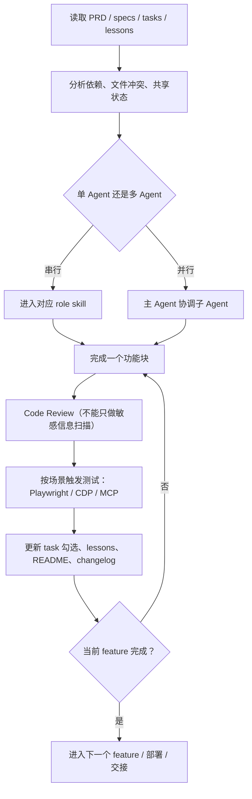

---
tags:
  - AI开发
  - 工作流
  - Agent
  - Skill
  - ClaudeCode
  - 自动化测试
  - 远程开发
aliases:
  - 27-AI开发相关讨论｜直播笔记整理
  - 27-AI开发相关讨论
  - AI开发相关讨论直播笔记
date: 2026-04-24
status: 已整理
source: 27-AI开发相关讨论.txt
---

# 27-AI开发相关讨论｜直播笔记整理

## 概览

这场基本就是 [[26-电商项目开发讨论｜直播笔记整理]] 的下午续集。主题已经不是“再写一个功能”，而是把上午那套 [[AI开发主流程]] 真正补齐成一条能跑通、能恢复、能远程接管、能控制成本的工程化工作流。

这场主要在收口五件事：

1. 把上午忘掉的两个尾巴补上：`远程监控 / 远程接管` 和 `移动端相关 skills / 调试链路`
2. 把 `command -> specs -> tasks -> coding -> review -> test -> doc sync` 串成一个闭环
3. 把 `skills` 的调用时机说清楚，尤其是前端、测试、review、文档同步
4. 把“长篇规则文档”压缩成“文本式流程图 + 节点 notes + 渐进式读取”
5. 把手机接管电脑、`tmux` 保活、内网打通、移动 SSH 这些兜底方案讲明白

它和下面这些笔记是连着看的：

* [[26-电商项目开发讨论｜直播笔记整理]]
* [[02-AI时代开发相关讨论｜直播笔记整理]]
* [[13-AIGC第二季提效讨论｜直播笔记整理]]
* [[Agent 与 Skill]]
* [[Skill 设计模式与任务编排]]
* [[AI开发主流程]]
* [[MCP工具栈]]
* [[浏览器控制与远程模式]]
* [[自动化测试]]
* [[前端自动化测试]]
* [[Cloudflare Tunnel]]
* [[Cloudflare 与 AWS 混合云架构]]

> [!note]
> 原始转写里有大量 `cloud / codis / future / spice / playread / televent` 之类的 ASR 错词。这份笔记已经按上下文做了纠正；遇到不能百分百坐实的产品名，我会尽量写成功能描述，不强行硬猜。

## 这场里需要先纠正的错词和概念

### 高概率错词

* `future` 基本都是 `feature`
* `spice / spy / spax / spell` 基本都是 `specs`
* `cloud / 点cloud` 大多是在说 `Claude / Claude Code`；如果指目录语境，则更像老师自定义的工作流目录
* `codis / codecs` 高概率是 `Codex`
* `query engineer` 基本是 `QA engineer`
* `playread / pre write / player` 基本都是 `Playwright`
* `Sypress` 是 `Cypress`
* `televent / telewind` 基本是 `Tailwind CSS`
* `snap / sneak` 在设计稿语境里大概率是 `Sketch`
* `Teamview` 是 `TeamViewer`
* `小龙虾` 这类口误大概率是在说 `向日葵` 远程控制
* `Cloudfire` 是 `Cloudflare`
* `CDP` 指的是 `Chrome DevTools Protocol`
* `Chrome Dev MCP` 指的是 `Chrome DevTools MCP`

### 需要纠正的几个理解

* `Code Review` 不能退化成“只扫敏感信息 / 硬编码密钥”；真正的 review 还要看命名、结构、边界、规范和实现风险
* `review` 的粒度也不能太粗。不是等一个超大 task 全做完再看，而是完成一个“有意义的功能块”就 review 一次
* 流程图不是不能用，但最好是模型可直接读取的文本式流程图，例如 `Mermaid`、结构化 flow 文本，而不是只贴 `PNG`
* `CDP` 和 `MCP` 是否弹窗，现场其实讨论得很反复；更稳妥的做法不是迷信某个工具，而是提前定义“钱包 / 登录 / 文件上传 / 系统授权”这类场景怎么走
* 远程控制不是为了“炫技手机写代码”，而是为了 `会话不断、电脑挂了能接管、终端断开能恢复`

## 核心结论

* 这一场的真正目标，是把上午那套 AI 开发流程补成一个 `可执行、可恢复、可 review、可远程接管` 的工程化闭环
* 主 command 不该写死“单 agent 串行”或“固定并行”，而是应该让 AI 按 `依赖关系 / 文件冲突 / 前后端共享状态` 自主决策
* `skills` 的价值不在“堆很多文件”，而在于让不同工种在进入某个阶段时自动补齐专业规则
* 前端 skill 最关键的不是生成页面，而是 `先问设计稿 -> 识别 Figma / Sketch -> 有 MCP 就调 -> 没有就按组件复用规范开发`
* 测试、review、doc sync 都不能拖到最后一次性做，否则返工会非常大
* 大段自然语言规则非常容易让模型漏要求，所以最好把稳定流程压成 `流程图 + 节点 notes + 按节点加载`
* 手机远程方案的核心不是“在手机上完整开发”，而是 `Tailscale / SSH / tmux / VS Code Remote / 远程桌面` 这些东西组合起来，保证主机会话不中断
* 运维和部署也可以抽成 skill，但在公司环境里常常会碰到权限、资源成本、审计留痕的问题，所以最好要求 AI 部署后输出资源清单和链接

## 一、00:00-08:48 先把上午漏掉的两件事找回来

### 1. 上午真正没收尾的，是两个“工程兜底问题”

老师开场先在回忆上午到底剩了什么，最后逐渐想起来主要是两件事：

* `远程监控 / 远程接管`：如果电脑挂了、VS Code 崩了、你人又不在电脑前，流程怎么续上
* `移动端 skills / 移动端调试链路`：手机端不是不能参与，但它应该参与到哪一层

除此之外，他还顺手把上午没讲透的几个点重新拉回来了：

* `长期记忆`
* `拆分的力度`
* `上下文限制`
* `安全最好抽出主编码流程`

也就是说，这一场不是又开一个新题，而是在给上午那套流程补“恢复力”和“工程细节”。

### 2. 不要把执行策略写死成“永远单 agent 串行”

老师这里对原来的 command 有一个很明确的修正：

* 原本写成“单 agent 串行执行，不使用 agent team”
* 现在他觉得这不该写死
* 更合理的是让 AI 自己分析：
* 任务之间有没有依赖
* 会不会修改同一批文件
* 前后端是否有共享状态
* 数据库 / API 的共享状态是否需要先定义

如果有强依赖、文件冲突或共享状态，就串行。
如果依赖弱、作用域独立，就并行。
而且并行时不是大家乱跑，而是“主 agent 负责协调，子 agent 分工执行，再统一汇报”。

这部分和 [[Skill 设计模式与任务编排]]、[[Agent 与 Skill]] 基本是同一条思路。

### 3. 这里已经把“移动端”从花活改成了工作流分支

老师想起来第二个遗漏点时，说得很清楚：

* 移动端不只是“拿手机看看”
* 移动端调试本身是一套活
* 所以未来如果要支持移动端开发或调试，就应该单独做对应的 skill 或分支流程

这件事在这场里没有完全展开，但方向已经定了：

* `桌面主开发链路`
* `移动端接管 / 调试链路`
* `远程守护链路`

最好不要混成一坨。

## 二、09:41-31:32 把主 command 和 skills 的编排补完整

### 1. 进入每个 feature 之后，先扫 `specs`，再出执行计划

老师这段实际上在精简和修命令：

* 进入每个 `feature`
* 先读取对应的 `requirements / design / tasks`
* 输出执行计划
* 明确输入参数
* 再决定串行还是并行

他现场也发现原来的 command 有不少重复表述，所以一直在删冗余、压缩长度。

这部分说明一件事：

* 真正有用的 command，不是写得越多越好
* 而是让模型先知道它现在在处理哪个 feature、读哪些规则、按什么判断继续往下走

### 2. “匹配工种 -> 找 skill -> 没有再自主决策”才是正确顺序

老师觉得原规则里漏了一步：执行到某个工种时，应该先检查有没有对应 `skill`。

也就是说正确顺序是：

1. 识别当前任务属于哪个角色
2. 看有没有对应的 skill
3. 有的话先调用 skill
4. 没有的话再交给 AI 自主判断

他现场提到的角色大致包括：

* `front engineer`
* `database / backend engineer`
* `QA engineer`
* `contract engineer`
* `doc sync`
* `code reviewer`

这里真正的重点不是“角色名写什么”，而是：

* `skill` 应该在角色切换时自动介入
* 而不是全靠主模型临时回忆

### 3. 前端 skill 的核心不是“会写页面”，而是先问设计稿和复用策略

老师对前端 skill 的要求非常具体：

* 前端开始前先问：是否有要还原的设计稿
* 设计稿要区分 `[[Figma]]` 还是 `[[Sketch]]`
* 如果有对应 `MCP`，先用 MCP 取设计上下文
* 如果没有设计稿或没有 MCP，再进入正常开发

除此之外，还要强制前端 skill 注意这些细节：

* `组件封装`
* `UI 组件库复用`
* `样式复用`
* `全局样式抽象`
* 业务缺设计稿时要及时提醒

老师还举了两个很实用的例子：

* 如果是 `[[Telegram Mini App]]` 这类项目，要格外注意样式复用
* 如果是 `[[Tailwind CSS]]` 项目，不同版本的全局样式封装方式并不一样，不能写得太散

他还强调：

* 如果已有设计稿足以推导出新页面，例如“注册页已经有了，登录页只是同风格变体”
* 那就可以直接继续开发
* 不要每一步都停下来再问一次

### 4. 测试和 doc sync 都不该等到最后才做

这段老师补了两个关键规则：

* 完成一个功能块后，就应该调用测试相关 skill
* 完成开发后，要调用 `doc sync` 去更新文档，而不是只改一个 `README`

他提到的文档范围包括：

* `README`
* 工作流说明文档
* `specs`
* `change log`
* 架构相关说明

而且 `change log` 最好按日期或 feature 去落，别全堆在一个地方。

这里的底层意思是：

* 文档同步不是补作业
* 它本身就是工作流的一部分

## 三、31:37-52:33 测试链路的争论：CDP、MCP、Playwright 到底怎么配

### 1. 老师一开始更偏向 `Chrome CDP`

他现场反复提到：

* 浏览器相关测试他更想走 `[[Chrome DevTools Protocol]]`
* UI 回归时直接开真实调试
* 不太想继续完全依赖 `[[Playwright]]`

但这不是“Playwright 完全没用”的意思，更像是：

* 对真实页面还原、临场调试、浏览器联动，他更习惯 `CDP`

### 2. 但一说到钱包、登录、授权弹窗，这件事就没那么简单了

现场围绕 `CDP` 和 `MCP` 有没有弹窗，来回讨论了好几轮。

比较稳妥的整理方式应该是：

* 常规 UI 回归、无状态页面、普通交互，可以优先走 `Playwright` 或 `CDP`
* 涉及 `登录 / Auth / 钱包授权 / 文件上传 / 系统级弹窗`，就不要假设一定能静默跑通
* 这类场景要提前定义：
* 是升级到 `Chrome DevTools MCP`
* 还是保留人工确认
* 还是允许用户在配置里设成 `ask`

老师自己也说了一个很实际的理由：

* 他平时更常用 `Chrome DevTools MCP`
* 因为如果 AI 在操作浏览器，而他本人也在动浏览器，互相会干扰
* 所以是否弹窗、谁来确认，应该写进规则，而不是现场临时猜

### 3. 更成熟的测试策略不是“只选一个工具”，而是按场景分层

从整场讨论里，可以提炼出更成熟的测试分层：

* `静态页面 / 普通交互`：`[[Playwright]]`、`[[Cypress]]`、普通浏览器自动化都可以
* `真实浏览器还原 / UI 对齐 / 页面联调`：`CDP`
* `钱包 / 登录 / 真实授权 / 需要人工感知的场景`：`MCP` 或显式 ask
* `feature 完成后的回归`：通过测试 skill 自动触发

老师其实是在把“测试工具选择”也做成一条规则，而不是拍脑袋换工具。

### 4. skills 的可视化和 VS Code 的体验并不稳定

他现场还踩到了几个很现实的坑：

* 本地 skills 在界面里不一定像插件一样可视化列出来
* VS Code 里有些渲染和调用体验不如聊天界面顺
* 用 MCP 画图时，聊天里可能能渲染，VS Code 里却不一定丝滑

这一段的结论很朴素：

* 不要把界面展示效果当成工作流本身
* 只要流程能跑，图能生成，命令能调用，体验问题是次一级的

## 四、52:41-01:13:05 真跑一轮以后，暴露出两个关键漏点

### 1. 实际执行时，AI 会去读 `feature / specs / requirements / design / tasks / lessons`

老师在现场跑的时候，明确提到了一条典型执行链：

* 找到一个 `feature`
* 读 `specs`
* 读 `requirements`
* 读 `design`
* 读 `tasks`
* 看 `lesson / lessons learned` 是否存在
* 如果不存在，就创建
* 然后再做依赖分析，决定开发顺序

这说明他已经把“项目记忆”和“需求执行”真正串到了一起，而不是靠会话历史硬记。

### 2. 第一个大漏点：所谓 review 一开始其实只是“敏感信息检查”

老师现场很快发现一个问题：

* 流程看起来像进了 `review`
* 但真正执行的更像是 `敏感信息扫描 / 硬编码证书检查`
* 这不是完整的 `Code Review`

所以他立刻修正了要求：

* 必须让 `Codex / code reviewer` 真正参与 review
* 传入本次变更的 `diff`
* review 结果不能只看 secrets
* 还要看代码命名、规范、安全性和实现合理性

这部分是整场里最有价值的一个纠偏：

* 很多所谓“自动 review”其实只是静态检查的一部分
* 真正的 `[[Code Review]]` 不能被偷换概念

### 3. 第二个大漏点：task 完成后没有打勾，断点恢复就会乱掉

老师又发现另一个很实际的坑：

* task 明明做完了
* 对应的 Markdown checklist 却没有打勾
* 这样后续恢复、续跑、排查进度时就会出问题

所以他要求：

* 每个 task 或每个功能块完成后
* 一定要同步更新 task 文件状态
* 不能跳过这一步

这件事听起来很小，但它其实关系到：

* `断点恢复`
* `重复执行避免`
* `多人协作可见性`
* `feature 级别追踪`

### 4. 模型为什么会漏这些步骤？老师给出的解释很重要

老师现场基本给出了答案：

* 上下文太多
* 规则太长
* 模型在专注写代码和编译下一个循环时，容易忽略中间的管理动作

所以这场后半段才会转向：

* 精简 command
* 压缩成流程图
* 变成按节点读取的 notes

问题不是模型“不聪明”，而是工程输入方式不对。

## 五、01:15:27-01:40:02 从“长文规则”切到“流程图 + 节点 notes + 渐进式读取”

### 1. 单靠长篇 Markdown 规则，确实容易漏

老师在这段把问题说得非常透：

* 仅靠一大段 Markdown 规则，很难把所有细节稳稳执行下来
* 文字越多，模型越容易漏掉关键动作
* 即便流程图本身没问题，细节也可能在执行时走样

所以他最后的思路变成了：

* 用流程图表达稳定主流程
* 用节点对应的 notes 承载细则
* 执行到哪个节点，再去读哪个节点的规则

这其实就是把“长上下文一次性灌进去”改成“渐进式上下文加载”。

### 2. 最稳的不是图片，而是模型可直接读的文本式流程图

老师现场其实一度提到了图、SVG、PNG，但结合上下文，最稳的结论应该整理成这样：

* 如果流程图只是截图或图片，模型每次都要重新理解它
* 图片理解容易有偏差
* 更稳的方式是：
* `Mermaid`
* 结构化 flow 文本
* 节点化说明

也就是说，最好让模型读“结构”，而不是只读“视觉”。

这对 Obsidian 也很友好，因为可以直接落成一张文本式流程图。

### 3. 这场最值得保留的流程图思路

上面这张图，其实就是老师整场一直在反复修的那条主线。

### 4. “按节点加载 notes”是这场最重要的降 token 思路

老师后面明显是想把规则改成这样：

* 平时只让主流程图留在最上层
* 每个节点再挂它自己的 notes
* 执行到对应节点，再读取对应规则

这样会带来几个好处：

* `token` 消耗更低
* 不用一上来读完所有文档
* 不容易把关键动作漏掉
* 多 agent 决策也更容易

这一段其实就是 [[AI开发主流程]] 里“上下文管理”那部分的工程化版本。

## 六、01:40:09-01:55:47 远程接管方案：目标不是高端，而是别断

### 1. 最简单的兜底方案：远程桌面

老师这里的态度很实在：

* 你如果只是怕电脑挂了、会话断了
* 最简单的就是 `[[TeamViewer]]`、`[[向日葵]]` 这类远程桌面
* 手机连电脑
* 电脑连手机
* 能接上去继续操作就够了

他的意思很明确：

* 不用一上来就追求最复杂的工程方案
* 能兜底就是好方案

### 2. 更适合程序员的组合：`Tailscale + SSH 客户端 + tmux`

老师后面介绍的更“开发者化”的方案，本质上是三段式：

* 用 `[[Tailscale]]` 一类工具把手机、家里电脑、公司电脑拉进一个虚拟局域网
* 手机上装 `[[Termius]]` 一类 SSH 客户端
* 主机上用 `[[tmux]]` 保持会话不掉

这套方案的关键点是：

* 不一定需要公网 IP
* 不一定需要手动折腾端口
* 多台设备登录同一账号后可以拿到内网地址
* 手机上直接 SSH 进目标机器
* `tmux` 保证 `Claude Code` 或其他命令行会话不断

老师强调的不是“手机算力多强”，而是：

* 手机只是入口
* 真正干活的还是那台主机

### 3. 还有一类玩法：`sshd + FRP + 终端 App`

他还提到另一种偏折腾的方案：

* Mac 上开 `sshd`
* 用 `[[FRP]]` 或端口映射把 SSH 端口暴露出去
* 手机上装终端 App
* 平时仍然靠 `tmux` 保活

这套更偏“我就想直接连终端，不一定非得远程桌面”的思路。

和上一套相比，它的特点是：

* 更自由
* 更像纯开发者方案
* 但网络和安全配置也更需要自己兜住

### 4. 还有一条“完整编辑器体验”路线：VS Code Remote

老师也提到：

* 电脑侧可以装 `Remote SSH`
* 远程连上后会自动装 `VS Code Server`
* 手机上也能接这个会话去改代码、看日志

但他也明确提醒了一个现实问题：

* 真正的瓶颈在主机内存
* 不是手机内存
* 主机一边跑开发、一边挂服务、一边挂远程会话，配置得跟上

所以远程方案的本质其实可以总结成：

* `内网打通`
* `会话保活`
* `主机资源够用`
* `必要时可随时接管`

这正好可以和 [[浏览器控制与远程模式]]、[[Cloudflare Tunnel]] 对照着看。

## 七、01:51:35-结束 部署、安全、作业与真正可复用的 skills

### 1. 运维 skill 可以有，但在公司里要考虑权限和审计

老师对运维 skill 的态度是：

* 技术上并不复杂
* 直接走 `MCP` 调云服务就能做
* 例如部署到 `[[AWS]]`、`[[Cloudflare]]` 这类平台

但问题不在“能不能做”，而在：

* 权限是否给你
* 资源花费是否可解释
* 领导是否愿意让 AI 直接动线上资源

所以更稳的做法是：

* 允许 AI 部署
* 但要求它部署后必须总结：
* 用了哪些资源
* 配了哪些规则
* 链接在哪里
* 大概花费和影响是什么

这也就是他说的那种“你不懂云资源没关系，但你得让它把结果交代清楚”。

### 2. 安全扫描应该尽早接进真实项目

老师提到自己近期要把代码交给外部团队审核，所以特别在意：

* 安全漏洞
* 金融 / Web3 类项目的质量
* 提前做安全扫描

这和他前面说“安全最好抽出主编码流程”并不矛盾，真正的意思是：

* 安全很重要
* 但不要把它混成主编码循环的一部分
* 更适合做成独立阶段、独立 skill 或独立审核流程

### 3. 不是所有 skill 都值得一开始就写很重

老师收尾时其实给了一个很实际的优先级：

* 最值得沉淀的，是 `前端 skill` 和 `review skill`
* 后端 skill 差异太大，尤其不同公司、不同语言、不同框架差别很大
* 所以很多后端 / 运维 / 特殊工种的 skill，可以现用现写

这其实也符合 [[技术选型方法]] 的思路：

* 先固化高复用、低争议、跨项目通用的部分
* 再按公司差异做定制

### 4. 这场作业的真正要求

老师最后布置的“作业”不是再抄一遍命令，而是：

* 把你自己的这套工作流跑通
* 按自己公司的流程改造
* 能在面试或工作场景里讲清楚：
* 怎么拆 `PRD / specs / tasks`
* 怎么做上下文管理
* 怎么决定多 agent 串并行
* 怎么做 code review
* 怎么做测试
* 怎么做远程接管

他最后还开玩笑说，可以把老师“蒸馏”成一个 skill 或 RAG。

这句玩笑背后真正的意思是：

* 把隐性的工作经验
* 转成显性的可复用规则
* 这本身就是现在 AI 开发里最值钱的事

## 可直接落地的版本

如果把这场压成一套最实用的落地建议，大概就是下面这 10 条：

1. 主 command 只保留稳定主流程，不要塞太多长篇自然语言
2. `feature` 进入后先读 `specs / tasks / lessons`
3. 串行还是并行，由 AI 根据依赖、文件冲突和共享状态判断
4. 进入某个工种前，先查有没有对应 skill
5. 前端 skill 必须先判断有没有设计稿、能不能调 `Figma / Sketch` 的 `MCP`
6. 完成一个有意义的功能块就做 `Code Review`
7. review 不能只扫 secrets，必须看真正的代码变更
8. task 做完必须打勾，不然断点恢复会乱
9. 测试按场景分层，不要强行一把梭同一个工具
10. 远程链路至少准备一个兜底方案，保证电脑挂了还能继续接管

## 相关笔记

* [[26-电商项目开发讨论｜直播笔记整理]]
* [[02-AI时代开发相关讨论｜直播笔记整理]]
* [[13-AIGC第二季提效讨论｜直播笔记整理]]
* [[Agent 与 Skill]]
* [[Skill 设计模式与任务编排]]
* [[AI开发主流程]]
* [[MCP工具栈]]
* [[浏览器控制与远程模式]]
* [[自动化测试]]
* [[前端自动化测试]]
* [[Cloudflare Tunnel]]
* [[Cloudflare 与 AWS 混合云架构]]
